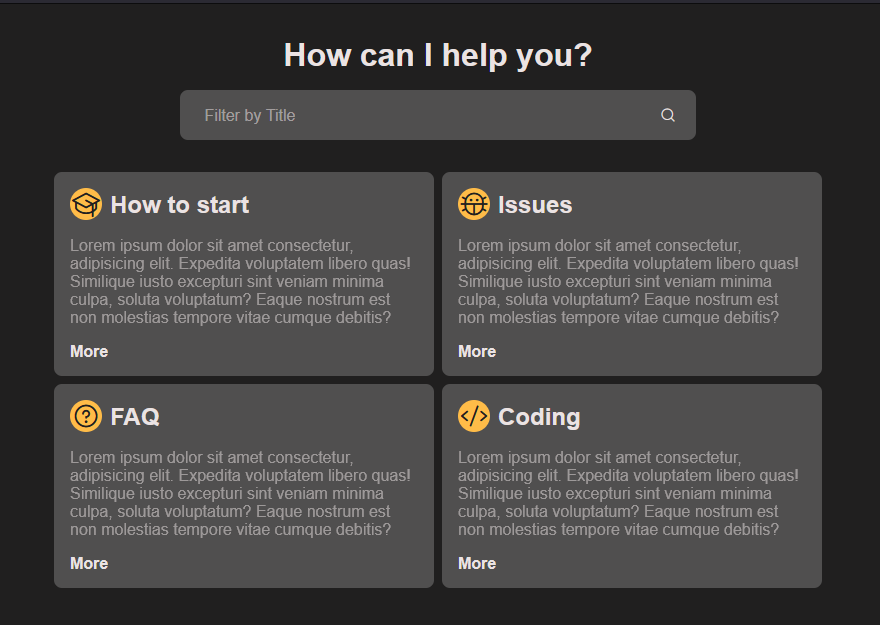

# Filtrando elementos no DOM com JS

[https://tuf-coder-filtrar-elementos-dom-js.netlify.app/](https://tuf-coder-filtrar-elementos-dom-js.netlify.app/)

[](https://app.netlify.com/sites/tuf-coder-filtrar-elementos-dom-js/deploys)

## PREVIEW

- Desktop


- Mobile


A aplicação deve conter:

* Um título principal contendo o texto "How can I help you?"
* Um campo de texto para ser o filtro contendo um ícone de lupa
* Quatro cartões cada um contendo um `ícone e um título`, um `parágrafo` e uma `âncora`
* Títulos:
  * How to start
  * Issues
  * FAQ
  * Coding
* Parágrafo:
  > Lorem ipsum dolor sit amet consectetur, adipisicing elit. Expedita voluptatem libero quas! Similique iusto excepturi sint veniam minima culpa, soluta voluptatum? Eaque nostrum est non molestias tempore vitae cumque debitis?
* Âncora:
  * Contém o texto "More" com referência ao `index.html`
  * Ao passar o mouse por cima a cor deve mudar para um tom claro de amarelo.

## Ícones

Utilizar a CDN do Phosphor Icons.

```html
<script src="https://unpkg.com/phosphor-icons"></script>
```

## Cores

* --white: #fff;
* --black: #000;
* --gray-100: rgb(235, 227, 227);
* --gray-300: rgb(80, 79, 79);
* --gray-500: rgb(32, 31, 31);
* --yellow-200: rgb(252, 208, 133);
* --yellow-400: rgb(255, 188, 72);

## JavaScript

Ao digitar no campo de texto "Filter" será exibido os cartões que o título contiver o valor que está sendo digitado.
